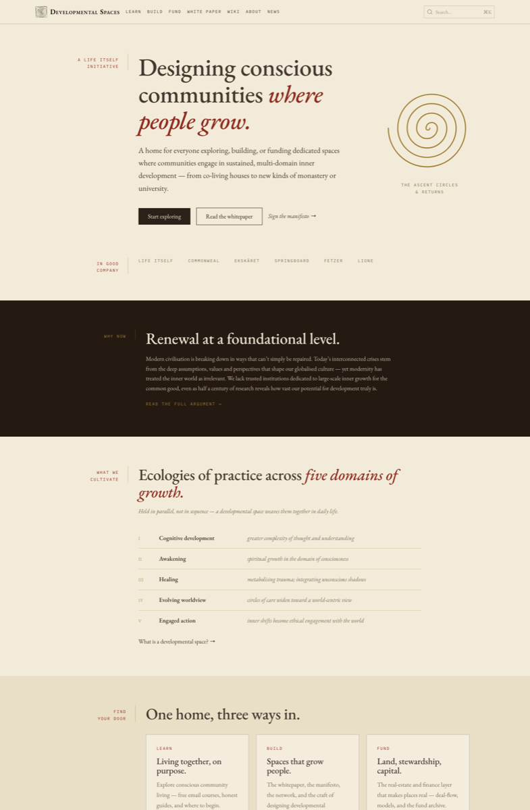
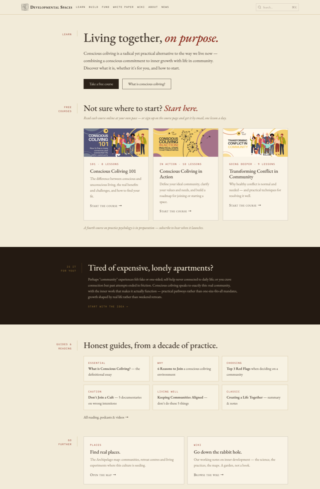

Four separate sites came together at [developmentalspaces.org](https://developmentalspaces.org), the single home for this work. consciouscoliving.org and tealestate.net moved in and their old addresses redirect here. The site is organised into three streams: **Learn** for anyone exploring conscious community living, **Build** for people creating a space or working on the field, and **Fund** for the capital side. The full story is in the announcement post, [A new home for Developmental Spaces](https://developmentalspaces.org/blog/a-new-home-for-developmental-spaces).

What arrived with it:

- The three email courses, [Conscious Coliving 101](https://developmentalspaces.org/learn/courses/conscious-coliving-101), [Conscious Coliving in Action](https://developmentalspaces.org/learn/courses/conscious-coliving-in-action) and [Transforming Conflict in Community](https://developmentalspaces.org/learn/courses/transforming-conflict), readable online in full: about 27 lessons, free. Signup now runs through our own mailer with a double opt-in.
- The [fund archive](https://developmentalspaces.org/fund/archive): the prospectus, the original strategic analysis, the project application questionnaire and the rest of the 2019 to 2021 work on a real-estate fund for conscious community, with the story [of why it did not launch](https://developmentalspaces.org/fund/the-fund-we-almost-built).
- A [wiki](https://developmentalspaces.org/wiki) of about 65 working notes on inner development and developmental science, and a [vision and strategy page](https://developmentalspaces.org/build/vision) with talks and decks.
- A new warm, parchment-toned look, with the spiral from the whitepaper cover as the site's mark, and a News & Notes section that began with the announcement post.

This design was replaced in September by the [Conscious Communities look](https://developmentalspaces.org/learn).
