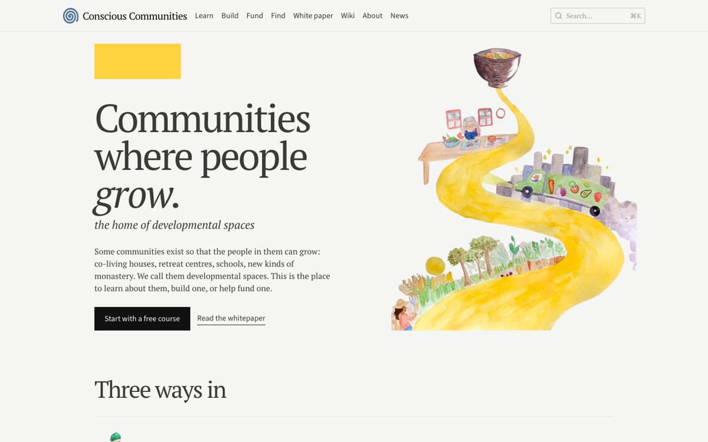
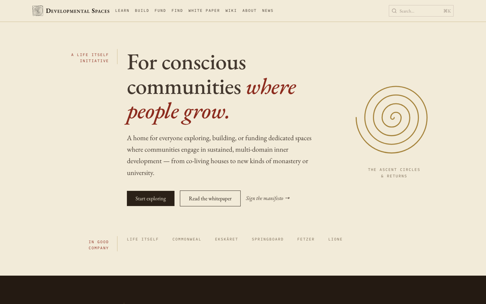
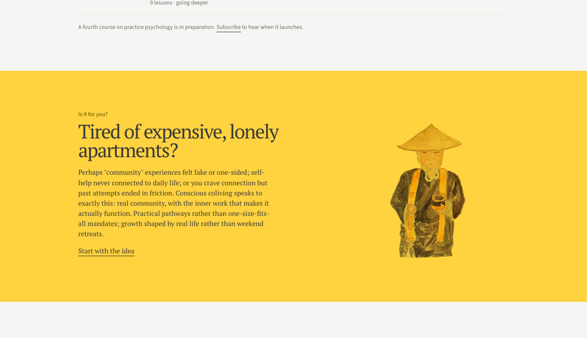
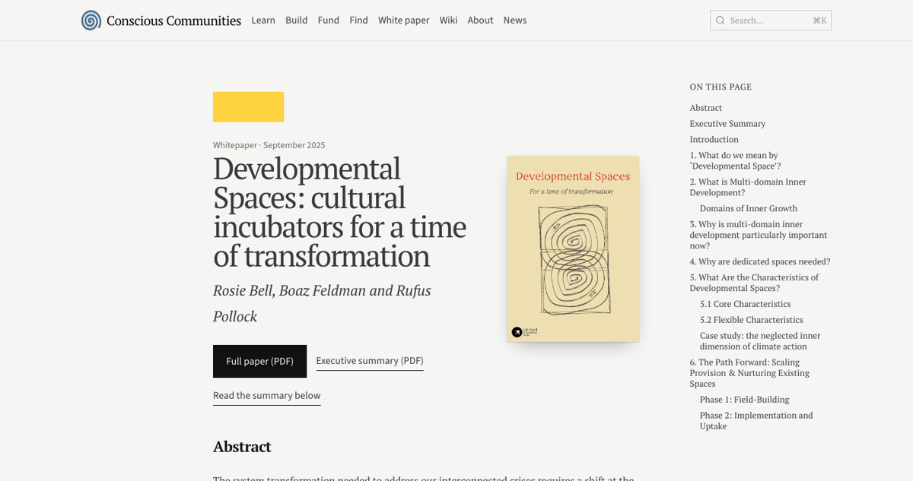

The site is now called **Conscious Communities**, and it has a new design to match. The address is the same, [developmentalspaces.org](https://developmentalspaces.org), but the front door now uses the words most people use for the places we write about. *Developmental spaces* stays the name of the idea, the [whitepaper](https://developmentalspaces.org/paper), the [manifesto](https://developmentalspaces.org/manifesto) and the network. The [About page](https://developmentalspaces.org/about) explains the two names.

The new look replaces the parchment-and-serif theme from July, which was warm but generic. The page is now near-white with one flat yellow, headings are set tight in a serif with an italic second line, and the pictures are watercolours rather than photographs or ornament, so the site looks like something made by the people behind it. The illustrations are by Jennifer Chan, from Life Itself's Awami Conscious Food book, and stand in until we have a set of our own.

What is new:

- A new [home page](https://developmentalspaces.org): the road from field to kitchen to bowl, then three ways in.
- [Learn](https://developmentalspaces.org/learn), [Build](https://developmentalspaces.org/build), [Fund](https://developmentalspaces.org/fund) and [Find](https://developmentalspaces.org/find) rebuilt in one layout: a single painting, plain lists in place of cards, and one yellow section carrying each stream's main idea.
- The [whitepaper](https://developmentalspaces.org/paper) and [manifesto](https://developmentalspaces.org/manifesto) open with a cover and a headline. The argument itself reads exactly as before.
- [What is a developmental space?](https://developmentalspaces.org/what) opens with a catalogue of painted things a developmental space is made of.
- A rebuilt [About page](https://developmentalspaces.org/about), restyled course signup forms, and a new mark and icon: a brushed spiral, carrying on the spiral from the whitepaper cover.

Everything published before is still there at the same addresses, including the courses, the fund archive and the wiki. Still to come: illustrations of our own, a redesign of the definition page around the whitepaper, and a pass on the words.
