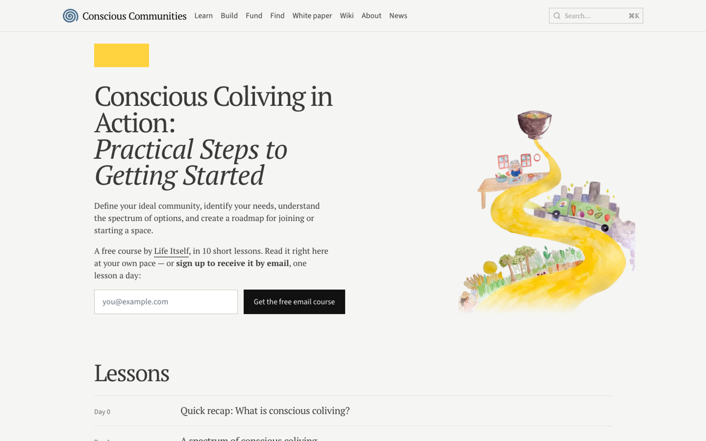

The course pages, [News & Notes](https://developmentalspaces.org/blog), the [reading list](https://developmentalspaces.org/learn/reading), the [fund archive](https://developmentalspaces.org/fund/archive) and [Network](https://developmentalspaces.org/network) now match the September redesign, with each course opening on its own painting. The wiki keeps its file tree and the rest of the site no longer shows one.

